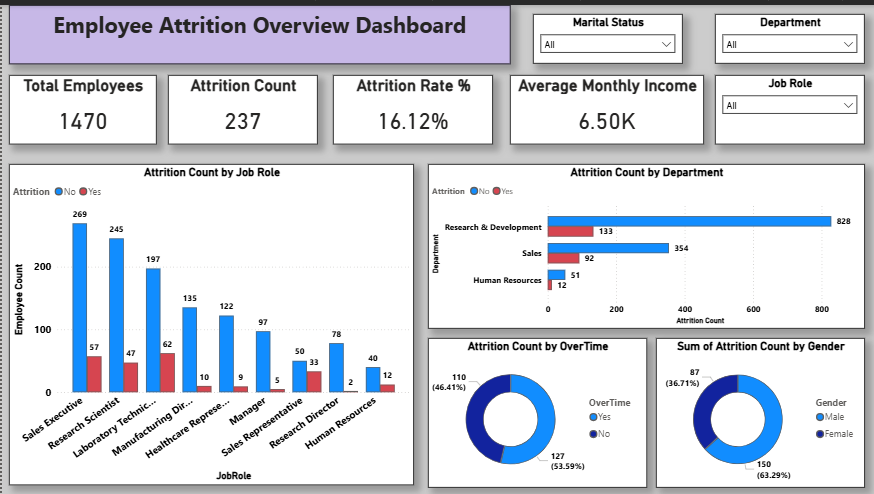
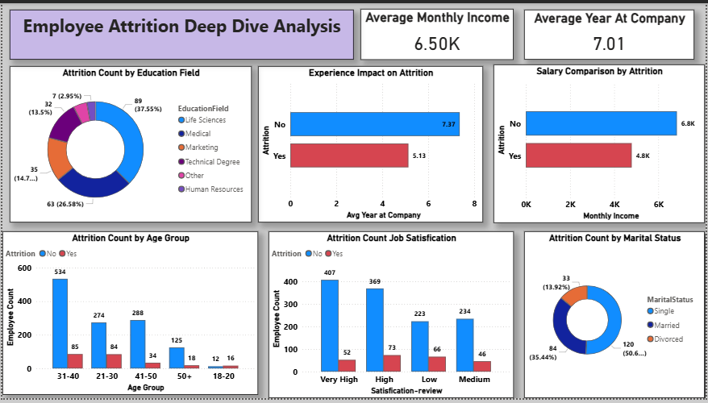
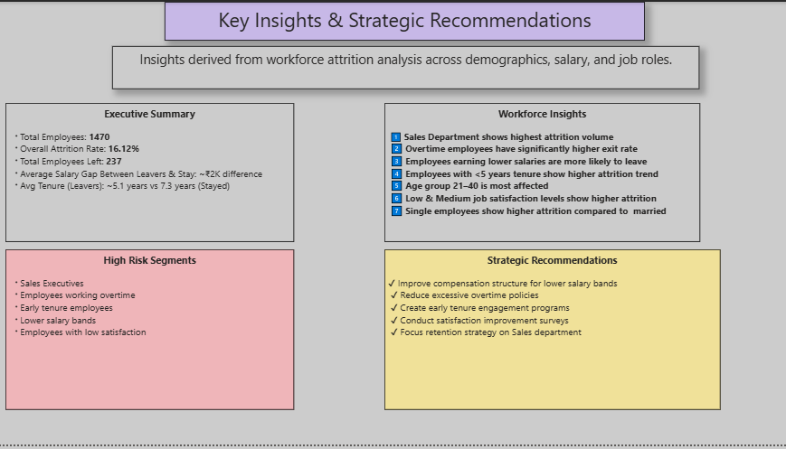

# 📊 HR Analytics Dashboard – Employee Attrition Analysis

## 📌 Project Overview

This project analyzes employee attrition using the IBM HR Analytics dataset to uncover workforce turnover trends and provide data-driven HR recommendations.

The project was completed in four major stages:

1. Data Cleaning & Exploratory Data Analysis (Python)
2. Interactive Dashboard Development (Power BI)
3. 25+ SQL Queries for Deep Analysis
4. Business Insight Generation & Strategic Recommendations

---

## 🧹 Data Cleaning & EDA (Python)

The dataset was cleaned and analyzed using Python (Pandas):

- Checked for missing values and corrected inconsistencies  
- Converted encoded categorical values (e.g., Education levels 1–5) into meaningful labels  
- Removed non-informative columns (EmployeeCount, StandardHours)  
- Performed pivot tables and cross-tab analysis  
- Compared attrition across departments, salary, tenure, and overtime  

This ensured reliable analysis before dashboard development.

---

# 📊 Dashboard Preview

---

## 🔹 Page 1 – Employee Attrition Overview

This page provides a high-level summary of workforce attrition across the organization.

### 📌 Key Metrics
- **Total Employees:** 1470  
- **Attrition Count:** 237  
- **Attrition Rate:** 16.12%  
- **Average Monthly Income:** 6.50K  

Approximately **1 in 6 employees** has left the company.

### 📊 Key Insights
- Sales and Research & Development show higher attrition volume.
- Sales Executive and Laboratory Technician roles have notable turnover.
- Employees working overtime show higher attrition.
- Male attrition count is slightly higher than female.
- Leadership roles show more stability compared to operational roles.

## 🔹 Page 2 – Deep Dive Analysis

### Major Analytical Findings
This page analyzes the key factors influencing employee attrition.

### 📊 Key Insights

- **Salary Impact:** Employees who left earn significantly less (4.8K avg) compared to those who stayed (6.8K avg).
- **Experience Impact:** Employees with lower tenure (~5.1 years) show higher attrition compared to long-tenured employees (~7.3 years).
- **Age Group:** Most attrition occurs in the 21–40 age group.
- **Job Satisfaction:** Lower satisfaction levels are associated with higher attrition.
- **Education Field:** Life Sciences and Medical backgrounds form the largest employee groups.
- **Marital Status:** Single employees show higher attrition compared to married employees.

This page answers the analytical question:

> “Why are employees leaving the organization?”

---

## 🔹 Page 3 – Insights & Strategic Recommendations

### Experience & Age Insights
- Employees with less than 5 years tenure show higher attrition.
- Attrition decreases as tenure increases.
- Most attrition occurs in the 21–40 age group.

### Job Satisfaction Impact
- Low satisfaction employees show higher attrition.
- Higher satisfaction strongly correlates with retention.

---

# 💡 Strategic Business Recommendations

- Improve compensation for lower salary bands  
- Reduce excessive overtime workload  
- Implement structured early-career engagement programs  
- Focus retention strategy on Sales department  
- Strengthen employee satisfaction initiatives  

---

## 🛠 Tools & Technologies Used

- Microsoft Power BI Desktop  
- DAX (Data Analysis Expressions)  
- Power Query  
- Python (Pandas, NumPy)  
- GitHub  

---

## 📂 Dataset Summary

- Dataset: IBM HR Analytics Employee Attrition
- Records: 1470 employees
- Target Variable: Attrition (Yes/No)

---

## 👤 Author

**Kuldeep Patidar**  
Aspiring Data Analyst  
Focused on HR Analytics & Business Intelligence  

---

⭐ If you found this project useful, feel free to star the repository.
